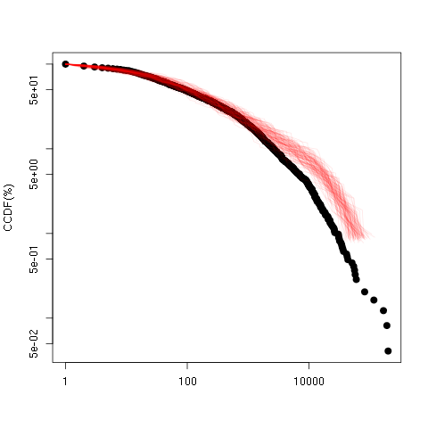

```{r, include = FALSE}
h = 5
w = 5
is_check <- ("CheckExEnv" %in% search()) || any(c("_R_CHECK_TIMINGS_",
             "_R_CHECK_LICENSE_") %in% names(Sys.getenv()))
knitr::opts_chunk$set(fig.height=h,fig.width=w,fig.align = "center", eval = !is_check)
knitr::opts_knit$set(global.par = TRUE) 
library(spreadrt)
```

```{r, include = FALSE}
par(mar=c(5,5,1,1))
defl <- par()
```


```{r, include = FALSE}
devtools::load_all()
allca$depth=allca$depth+1
```
# Introduction
In order to find the range of parameters for the different model that allows us to reproduces the different distributions observed, we use a simple implementation of Approximate Bayesian Computation. This implementation is mostly a simple modification of the Crema _et al._ version available [here](https://github.com/ercrema/CulturalTransmissionModel). 
The basic Idea is to randomly sample the parameter space and to compute a distance between the result of the simulations and the data (cf section before).

```{r}
allru=c()
allru$size=tapply(allca$size,allca$rumor_id,sum)

trueru=c()
trueru$size=tapply(trueca$size,trueca$rumor_id,sum)

falseru=c()
falseru$size=tapply(falseca$size,falseca$rumor_id,sum)
```


# The distance function

**TODO**
So far we are trying three homemade distance function:

* `quantilediff`

* `kokldiff`
  
* `kldiff`

We use the homemade `quantilediff` function:
```{r,echo=F}
quantilediff
```

$$\sqrt{\sum_{i=1}^{100}{\left(Pi\left(log(S)\right)-Pi\left(log(D)\right)\right)^2}}$$
Where $Pi(S)$ is the $i$th Percentile of the sample $S$.

But as suggest by Mike we may use a KL divergence. I gues that somehow my function is not so far to it, one way to look at it would be to compare both score and to see how they are correlated.

the  : `kokldiff`, a more KL-like function:

$$\sum{\frac{log(S_i))}{log(D_i)}*D_i}$$


And finally `kldiff`, an even more KL-like function:

$$\sum{\frac{log(P_i))}{log(Q_i)}*O_i}$$

To determine P and Q:
**TODO**

# Random Model

## (reproducible version)

### Generate the simulation
In its simplest form, the chosen version of ABC used for this work will look like this: 
(this is almost a strict adaptation of [this](https://github.com/ercrema/CulturalTransmissionModel)

#### Definition of priors
We choose a number of simulation,`r nsim=50 `. We then define the prior of the parameter of the simulation:
```{r}
# Define Prior Ranges 
prior_Nmin=c(100,500)
prior_mu=c(0.0001,0.1)
prior_Nmax=c(100,500)
prior_t_step=c(5,20)
prior_tau=c(1,100)
```

#### Comparasion with data
##### Prepare the data
We want then to compare the result of our model `randomCascades` to the size of the rumors and cascades observed in the dataset.
We will create an intermediary object `observation` that will store both value: the count of the size of the cascades (Voroughi et al.)  and the count of the size of the rumors.

```{r}
data(allca)
observation=c()
observation$casize = allca$size
observation$rusize =tapply(allca$size,allca$rumor_id,sum)
```

This will be useful to see when the model is able to reproduce one kind of measurement, or the other, or both. 

```{r,include=F}
data(scores)
data(scores.ext)
data(parameters)
```

##### Sample prior space
Then we sample the prior space :

```{r,eval=F}
parameters=list(
                # uniform sample of the prior ranges
                Nmin=sample(prior_Nmin[1]:prior_Nmin[2],nsim,replace=T),
                Nmax=sample(prior_Nmax[1]:prior_Nmax[2],nsim,replace=T),
                mu=runif(nsim,prior_mu[1]:prior_mu[2]),
                t_step=sample(prior_t_step[1]:prior_t_step[2],nsim,replace=T),
                tau=sample(prior_tau[1]:prior_tau[2],nsim,replace=T)
                )
```

The list `parameters` will then store a list of 4 vectors with `nsims`=`r nsim` elements.

```{r,include=F}
summary(parameters)
```

##### Run the simulation
We can then run the simulations, for 1 to `nsim`, each of which we will use one set of parameters. 

```{r,eval=F}

scores=sapply(1:nsim,function(i,parameters,obs,fold)
             {
              s_simu=randomCascades(
                                    Nmin=parameters$Nmin[i],
                                    Nmax=parameters$Nmax[i],
                                    mu=parameters$mu[i],
                                    t_step=parameters$t_step[i],
                                    tau=parameters$tau[i]
                                    )
              c(rumors=quantilediff(s_simu$size , obs$rusize),cascades=quantilediff(s_simu$size , obs$casize))
             },obs=observation,parameters=parameters)
```

The example propose a small `nsim` and parameters that are known to run fast in order for the reader to be able to quickly  reproduce the entire example. To accelerate the generation of the vignette and to show nicer result, we provide a dataset with more simulation in `data(parameters)` and `data(scores)` that we use to generate the following output (if you want to generate your own, just use a bigger `nsim`, and wait).

```{r,eval=F}
scores=as.data.frame(t(scores)) #transform the results as a data.frame to simplify later manipulations 
summary(scores)
```

### Distance to dataset

#### Preliminary analysis and exploration
From this we can already check different things. For example: the distribution of the score given the pattern we observe :

```{r,fig.width=1.5*w}
par(mfrow=c(1,2),mar=c(5,5,2,1))
plot(density(scores$rumors),main="Distance to size of rumors",xlab="distance to data")
plot(density(scores$cascades),main="Distance to size of cascades",xlab="distance to data")
```

We can check how those two distances are correlated:

```{r}
## distance correlation
par(mfrow=c(1,1),mar=c(5,5,2,1))
plot(scores$rumors ~ scores$cascades,col=alpha("black",.5),xlab="distance to cascades size",ylab="distance to rumors size")
```

Even with the relatively small number of simulations used here, we can already see how it's impossible to minimize both distances at the same time.

To perform the ABC itself, we only need the score for each simulation and the value of the parameters for this simulation. But we can keep more information to check if, indeed, the distance function used bring use closer to the observed data.

```{r,eval=F}
## re-run simulation but keeping more things
scores.ext=lapply(1:nsim,function(i,parameters,obs,fold){
              s_simu=randomCascades(
                                    Nmin=parameters$Nmin[i],
                                    Nmax=parameters$Nmax[i],
                                    mu=parameters$mu[i],
                                    t_step=parameters$t_step[i],
                                    tau=parameters$tau[i]
                                    )
              sc=list(rumors=quantilediff(s_simu$size , obs$rusize),cascades=quantilediff(s_simu$size , obs$casize))
              res=list(scores=sc,rd=s_simu)
              return(res) 
                },obs=observation,parameters=parameters)
```

In `scores.ext` we keep the full result of the simulation _ie_ not only the score but the full distribution of the sizes of all cascades.

As before, the next output are produced by the data provided by `data(scores.ext)` to avoid evaluation time.

From this list we can get the best simulation with regard to the rumors size :


```{r,fig.height=1.2*h,fig.width=1.2*w}
par(mar=c(5,5,1,1))
rscors=sapply(scores.ext,function(l)l$scores$rumors)
best=scores.ext[rscors == min(rscors)][[1]]
plotCCFD(allca$size,cex=1,pch=1)
pointsCCFD(allru$size,cex=1,pch=2)
pointsCCFD(best$rd$size,cex=1,col="red")
legend("bottomleft",legend=c("data (cascade)","data (rumor)","best simulation"),col=c(1,1,"red"),pch=c(1,2,20),cex=.8)
```

And compare to the best simulation with regard to the cascade size 


```{r,fig.height=h,fig.width=w}
par(mar=c(5,5,1,1))
rscors.c=sapply(scores.ext,function(l)l$scores$cascades)
best.c=scores.ext[rscors.c == min(rscors.c)][[1]]
plotCCFD(allca$size,cex=1,pch=1)
pointsCCFD(allru$size,cex=1,pch=2)
pointsCCFD(best$rd$size,cex=1,col="red")
pointsCCFD(best.c$rd$size,cex=1,col="green")
legend("bottomleft",legend=c("data (cascade)","data (rumor)","best simulation (rumor)","best simulation (cascade)"),col=c(1,1,"red","green"),pch=c(1,2,20,20),cex=.8)
```

We can check that for all simulations (here we also use the distance to the data to color the curve).

```{r,echo=FALSE,message=FALSE,warning=FALSE}
par(mar=c(5,5,1,1))
cols=alpha(topo.colors(length(rscors)),.5)
names(cols)=as.character(sort(rscors))

plotCCFD(allru$size,cex=1,pch=1,main="simu vs rumor size")
n=lapply(scores.ext,function(l)
       pointsCCFD(l$rd$size,col=cols[as.character(l$scores$rumors)],type="l",lwd=3)
       )
```

```{r,message=FALSE,warning=FALSE,echo=F}
par(mar=c(5,5,1,1))
cols=alpha(topo.colors(length(rscors.c)),.5)
names(cols)=as.character(sort(rscors.c))

plotCCFD(allca$size,cex=1,pch=1,main="simu vs cascade size")
n=lapply(scores.ext,function(l)
       pointsCCFD(l$rd$size,col=cols[as.character(l$scores$cascades)],type="l",lwd=3)
       )
```

Once we find a distance function and pattern that satisfy use we can generate and analyse the posteriors.


### Generation and Analyses of the posteriors

#### Select the posteriors 
We can then create the posterior distribution by taking only a subset of the best simulation.

```{r}

#We use back the first dataframe generate as it will be easier to manipulate and we don't need anymore the full distributions of size

parameters.df=as.data.frame(parameters)
posteriors.r=parameters.df[rank(scores$rumors) < 100,]
posteriors.c=parameters.df[rank(scores$cascades) < 100,]

```


#### Visualize and compare the shape of the posteriors

The posteriors correspond to the distribution of parameters for the 10 best simulations (then 1% of the closest simulations to the data)

let see for the parameter $\mu$:
```{r,fig.width=1.2*w,fig.height=h}
par(mar=c(5,5,1,1))
prior=density(parameters.df$mu) #prior distribution
postC=density(posteriors.c$mu)  #posterior distribution for distance to cascade size
postR=density(posteriors.r$mu)  #posterior distribution for distance to rumors size
rangex=range(parameters.df$mu)
rangey=range(prior$y,postC$y,postR$y)
plot(prior,ylim=rangey,xlim=rangex,lwd=2,main="Prior vs Posterior for param mu",xlab="mu")
lines(postC,col="yellow",lwd=2)
lines(postR,col="green",lwd=2)
legend("topright",legend=c("prior","posterior Cascade","posterior Rumors"),lty=1,lwd=2,col=c(1,"yellow","green"))
```

We can see that in order to produce result closer to the distribution of cascades size, the model has to have a really high mu. 


We can repeat this for all the parameters


```{r,fig.height=2*h,fig.width=1.5*w}
par(mfrow=c(3,2),mar=c(5,5,1,1))
for(param in colnames(parameters.df)){
    prior=density(parameters.df[,param]) #prior distribution
    postC=density(posteriors.c[,param])  #posterior distribution for distance to cascade size
    postR=density(posteriors.r[,param])  #posterior distribution for distance to rumors size
    rangex=range(parameters.df[,param])
    rangey=range(prior$y,postC$y,postR$y)
    plot(prior,ylim=rangey,xlim=rangex,lwd=2,main=paste("Prior vs Posterior for param",param),xlab=param)
    lines(postC,col="yellow",lwd=2)
    lines(postR,col="green",lwd=2)
}
```


### Post validation of posteriors

A good thing to do is to check the robustness of the posterior found, _ie_ how well the distribution of parameter selected can reproduce the data.

One usual thing to do so this is to resample new set of parameters from the posterior, re-run simulation with those new set and to check if the rejection algorithm didn't selected a good set of parameter by chance.

For a matter of simplicity we will here just rerun 10 simulations for each of the best parameters selected and visually check  how far the diverge from the data.
 
#### validation wrt rumors size 


```{r,include=FALSE,warnings=F}
par(mfrow=c(1,1))
par(defl)
```

```{r}
plotCCFD(allru$size,main="rerun using posterior distrib",xlab="rumor size")
nan=apply(posteriors.r,1,function(u){replicate(10,pointsCCFD(randomCascades(Nmin=u["Nmin"],Nmax=u["Nmax"],mu=u["mu"],t_step=u["t_step"],tau=u["tau"])$size,type="l",col=alpha("chartreuse",.4)))})
legend("bottomleft",legend=c("data","simulation ran using posterior best fit"),col=c("black",alpha("chartreuse",.4)),lty=c(1,1),lwd=c(3,1))
```

We can do the same with the using the median of the distribution of the parameter or the best set of parameter found.

```{r,fig.width=1.5*w}
par(mfrow=c(1,2))

#median
median_best_param=apply(posteriors.r,2,median)
plotCCFD(allru$size,main="median",xlab="rumor size")
na=replicate(100,pointsCCFD(randomCascades(Nmin=median_best_param["Nmin"],Nmax=median_best_param["Nmax"],mu=median_best_param["mu"],t_step=median_best_param["t_step"],tau=median_best_param["tau"])$size,type="l",col=alpha("red",.1)))
legend("bottomleft",legend=c("data","simulation ran median of posterior"),col=c("black",alpha("red",.1)),lty=c(1,1),lwd=c(3,1))

#best
best_param=unlist(parameters.df[which(rank(scores$rumors) == 1),])
plotCCFD(allru$size,main="best",xlab="rumors size")
na=replicate(100,pointsCCFD(randomCascades(Nmin=best_param["Nmin"],Nmax=best_param["Nmax"],mu=best_param["mu"],t_step=best_param["t_step"],tau=best_param["tau"])$size,type="l",col=alpha("red",.1)))
legend("bottomleft",legend=c("data","simulation using best fit"),col=c("black",alpha("red",.1)),lty=c(1,1),lwd=c(3,1))

```

Obviously, as we built our posterior using very few simulations, the median here won't be the median of the true posterior. The fact that the new simulations re run using this median of the posterior distribution doesn't really fit well the data should not be interpreted here as a problem from the model, but from the small size of the sample used to draw the posterior and compute the median.

#### validation wrt cascade size
```{r}
par(mfrow=c(1,1))
plotCCFD(allca$size,main="erun using posterior distrib",xlab="cascade size")
nan=apply(posteriors.c,1,function(u){replicate(10,pointsCCFD(randomCascades(Nmin=u["Nmin"],Nmax=u["Nmax"],mu=u["mu"],t_step=u["t_step"],tau=u["tau"])$size,type="l",col=alpha("chartreuse",.4)))})
legend("bottomleft",legend=c("data","simulation ran using posterior best fit"),col=c("black",alpha("chartreuse",.4)),lty=c(1,1),lwd=c(3,1))
```

We can do the same with the using the median of the distribution of the parameter or the best set of parameter found.

```{r,fig.width=1.5*w}
par(mfrow=c(1,2))
median_best_param=apply(posteriors.c,2,median)
plotCCFD(allca$size,main="median",xlab="cascades size")
na=replicate(100,pointsCCFD(randomCascades(Nmin=median_best_param["Nmin"],Nmax=median_best_param["Nmax"],mu=median_best_param["mu"],t_step=median_best_param["t_step"],tau=median_best_param["tau"])$size,type="l",col=alpha("red",.1)))
legend("bottomleft",legend=c("data","simulation ran median of posterior"),col=c("black",alpha("red",.1)),lty=c(1,1),lwd=c(3,1))

best_param=unlist(parameters.df[which(rank(scores$cascades) == 1),])
plotCCFD(allca$size,main="best",xlab="cascades size")
na=replicate(100,pointsCCFD(randomCascades(Nmin=best_param["Nmin"],Nmax=best_param["Nmax"],mu=best_param["mu"],t_step=best_param["t_step"],tau=best_param["tau"])$size,type="l",col=alpha("red",.1)))
legend("bottomleft",legend=c("data","simulation using best fit"),col=c("black",alpha("red",.1)),lty=c(1,1),lwd=c(3,1))

```

### Conclusions
More generally,no conclusion can be drawn using only the small number of simulations provided here. Only a few of them are really close to the distance function chosen, meaning that the distribution cannot be trusted. 

## (Real case application $4.5\times 10^6$ simulations)

### Generate the simulations

Using HPC facilities we ran 4.5 millions simulation, using the same general idea that the one presented in the previous sections. Though the code to produce the 4 millions has to be a bit changed from the one presented here. The simulations have to be run in parallel computer and split between different sub-folders and sub-files as it can quickly take a lot of space. As an illustration, the total size of all folders used to output the 4.5millions simulation presented here was $\approx8.9Tb$


### Distance to dataset

We first check the distribution of both distances for all simulation


And we see how both distances are correlated


### Analyse the posteriors

Then we select the best 500 simulations and draw the  posteriors distribution


In those representation the red distribution represent the prior distribution, the blue one the posterior for the model compared to the rumors size and the yellow one the model when compared to the cascades size

Du to it's strong impact on both model we redraw the graph for the posteriors of mu:


$\mu$ has to be around $2\times10^4$ for the model to be able to produce the distribution observed in the data set when taking the rumor size, whears it as to be betwen .2 and .3 when trying. This part may not be relevent as the results given when trying to fit the cascades size are not very relevent, but it's interesting to notice it.

we can also check if some parameters are correlated:


### Post validation of posteriors

#### wrt rumors size 
When trying to fit the model to the whole rumor size:

Check all the parameter selected by the rejection algorithm:


check the best set of parameters



check the median of the distribution of parameters


#### wrt cascades size 

When trying to fit the model to each cascades size:

check all the parameter selected by the rejection algorithm:


check the best set of parameters


check the median of the distribution of parameters


The visual post check of the posteriors distribution already show us that the model is clearly not able to reproduce the distribution of cascades, which we already guessed through the first simplest analysis.

We can see that the result are pretty robust. 

### Quick ccl

The general impression is that if we count together the cascades carrying the same information, this model may be a good candidate to reproduce the distribution observed. In this analysis I choose to limit the prior for the time step to a relatively low level, for time constraint. This results in the model often unable to generate the few rumors with very big size. But, we could expect that by waiting more time, the biggest rumors will continue to be shared and grow more. Regarding the posterior distribution, it's pretty clear that the $\mu$ parameter as to be really low, even if it's deeply correlated to $\tau$ and the number of time step.

# Multiple-dim Cascades Model

## (reproducible version)
The general shape of the ABC algorithm and exploration will be the same than the previous part, expect that we have to take into account this time: 

* more parameter with non uniform distribution

And thus to cope with that:

* more metrics to compare

As in the previous scenario, to allow people to quickly test and repeat the whole experiment, we choose here a small number of simulation,`r nsim=50 `. Then we provide data set with more repetition to plot nicer graph without the need of rerun all, and at the end we will show the result for the full experiment. 

### Generate the simulation

```{r}
### Define Prior Ranges and other statics information used to generate prior distribution###
prior_N=c(300,10000)
prior_R=c(10,1000)
prior_beta=c(-100,-10,0,10,100)
prior_utility=c(-1,0,1)
prior_repetition=c(5,50)
prior_captl=c(100,1000)
prior_lambda_c=c(0.00001,.1)
prior_IC=c(50,10000)
prior_Nmax=c(0.001,.5)
prior_dtime=c(1:5,-1)
prior_stime=c(1:5,-1)
```
Some of the parameters we want to explore are related to the one explored in the random scenario. 

* `N`: The total number of agent
* `R`: The total number of rumor
* `beta`: The way agents will be distributed 
* `utility`: The way the _utility_ of the rumor will be distributed
* `repetition`: the length of the simulation
* `captl`: the maximum size of the Timeline the agents can scroll through
* `lambda_c`:the rate of apparition of new cascades
* `IC`: the initial number of cascades
* `Nmax`: the maximum number of agents interacting at the same time
* `dtime`: the time the cascades can be seen by the agent
* `stime`:

Among the new specific parameters, two are of crucial importance: 

* `beta`

* `utility`

They are the one setting the distribution of beta among the population of retweeting agent  and the utility among the population of rumors.

We want then to compare the result of our model `cascades3D` to the three metrics presented in vosoughi et al : 

1. the size of the cascades 

2. the depth of the cascades

3. the breadth of the cascade


```{r}
data(allca)
observation=array(dim=c(nrow(allca),3))
metrics=c("size","depth","breadth")
colnames(observation)=metrics
for ( m in metrics)
    observation[,m] = allca[,m]
```

```{r,include=F}
data(scores.3D)
data(scores.ext.3D)
data(parameters.3D)
```

Then we sample the prior space :

```{r,eval=F}
### Create Parameter Space ###
parameters=list(
                ### Define Prior Ranges ###,
                N=sample(prior_N[1]:prior_N[2],nsim,replace=T),
                R=sample(prior_R[1]:prior_R[2],nsim,replace=T),
                betaDistrib=generalPartition(nsim,length(prior_beta)),
                utility=generalPartition(nsim,length(prior_utility)), #this will contain the percentage for each class of utility 
                repetition=sample(prior_repetition[1]:prior_repetition[2],nsim,replace=T),
                captl=runif(nsim,prior_captl[1],prior_captl[2]),
                lambda_c=runif(nsim,prior_lambda_c[1],prior_lambda_c[2]),
                IC=sample(prior_IC[1]:prior_IC[2],nsim,replace=T),
                Nmax=runif(nsim,prior_Nmax[1],prior_Nmax[2]),
                dtime=sample(prior_dtime,nsim,replace=T),
                stime=sample(prior_stime,nsim,replace=T)
                )
```

The list `parameters` will then store a list of objects with `nsim`=`r nsim` elements. Notice that unless like in the previous experiment, all the objects are not necessarily 1-dimension vector.
For example here `parameters$betaDistrib` is a table of the dimension $nsim \times nclasse$, where $n class$ is the number of classes that the agents can pick up their beta from.

```{r,include=F}
summary(parameters)
```

The idea behind `parameters$betaDistrib`  and `parameters$utility`, is that they represent the percentage of respectively `agent` and `rumor` that will be associated with the beta or the utility of the class of the same induce as defined in `prior_utility` and `prior_betaDistrib`.

For example lets randomly choose one set of parameters `r j=sample.int(nsim,1)`.

then the list of parameter for j are:
```{r}
param_j=lapply(parameters,function(p,ind=j)if(!is.null(dim(p)))p[ind,]else p[ind])
```

We know that the classes for the beta value of the agent are : `prior_beta`  = `r print(prior_beta)`

Then can say that in the simulation `r j`, we will have `param_j$betaDistrib[1]` $=$ `r param_j$betaDistrib[1]` agent with $\beta = `r prior_beta[1]`$ .


To calculate this  `parameters$betaDistrib` we use the function `generalPartition(a,n)`, which will generate `a` split in `n` different subset such as any subset as a chance of being in $[0,1]$, the sum of all subset is always equal to 1 and that, for an $x \in [0,1]$ and any subsets (1,2) of size $(s_1,s_2)$ , $P(s_1 = x) = P(s_2 = x)$ (ie  all the subset have the same probility to be equal to any number between 0 and 1).


We can then run the simulations, for 1 to `nsim`, each of which we will use one set of parameters. 

```{r,eval=F}

scores=lapply(1:nsim,function(i,parameters,obs)
{
    simres=cascades3D(
         log=F, 
         N=parameters$N[i],
         R=parameters$R[i],
         betadistrib=generateDistribeFromFrequencies(prior_beta,parameters$N[i],parameters$betaDistrib[i,]),
         utility=generateDistribeFromFrequencies(prior_utility,parameters$R[i],parameters$utility[i,]),
         time=parameters$repetition[i],
         captl=parameters$captl[i],
         lambda_c=parameters$lambda_c[i],
         Nmax=parameters$Nmax[i],
         dtime=parameters$dtime[i],
         stime=parameters$stime[i]
     )
     qc=lapply(metrics,function(m) quantilediff(simres[[m]],obs[[m]]))
     names(qc)=metrics
     kc=lapply(metrics,function(m) kldiff(simres[[m]],obs[[m]]))
     names(kc)=metrics
     return(list(kc=kc,qc=qc))

},obs=allca,parameters=parameters)

```

The example propose a small `nsim` and parameters that are known to run fast in order for the reader to be able to quickly  reproduce the entire exemple. But accelerate the generation of the vignette we will use to produce the next output the sample provided by `r data(parameters.3D)` and `r data(scores.3D)`

This time the sores are made of various elements. So far we want to keep them separate to see how they are related, so there is a bit more work to concatenate all as a `data.frame`.

```{r,eval=T}
#scores=as.data.frame(t(scores)) #transform the results as a data.frame to simplify later manipulations 
kc=as.data.frame(t(sapply(scores,function(s)unlist(s[["kc"]][metrics]))))
qc=as.data.frame(t(sapply(scores,function(s)unlist(s[["qc"]][metrics]))))
summary(kc)
```

We can also transform the parameter list in a dataframe, note that now some of the column has to be split in multiple dimension.

```{r}
parameters.df=as.data.frame(parameters)
```

### Explore the distance to dataset

From this we can already check different things. For example, the distribution of the score given the distance functions: used :

```{r,fig.width=1.5*w}
par(mfrow=c(2,3),mar=c(5,5,2,1))
na=sapply(metrics,function(m) plot(density(kc[,m]),main=paste("KC to",m,"of rumors",xlab="distance to data")))
na=sapply(metrics,function(m) try(plot(density(qc[,m]),main=paste("QC to",m,"of rumors",xlab="distance to data"))))
```

For both distance function used, we observe that the model give aprox same results regardless the metrics observed.

We can check how those two distances are correlated:

```{r}
## distance correlation
plot(kc)
```
As in the dataset, size and breadth are heavily corelated.

To perform the ABC itself, we only need the score for each simulation and the value of the parameters for this simulation. But we can keep more information to check if, indeed, the distance function used bring use closer to the observed data.

```{r,eval=F}
### detailed output ###
## re-run simulation but saving more details
scores.ext=lapply(1:nsim,function(i,parameters,obs){
    #We just print the id to keep track where we are
    print(paste0("simulation num: ",i,"/",nsim)) 
    #We print the parameter fr this simulation
    print(sapply(parameters,function(p)p[i]))
    #an example on how we could also measure the time spend in one simulation
    start.time <- Sys.time()
    simres=try(
        cascades3D(
            ### The list of parameters for cascades3D ###
            log=F,
            N=parameters$N[i],
            R=parameters$R[i],
            betadistrib=generateDistribeFromFrequencies(prior_beta,parameters$N[i],parameters$betaDistrib[i,]),
            utility=generateDistribeFromFrequencies(prior_utility,parameters$R[i],parameters$utility[i,]),
            time=parameters$repetition[i],
            captl=parameters$captl[i],
            lambda_c=parameters$lambda_c[i],
            Nmax=parameters$Nmax[i],
            dtime=parameters$dtime[i],
            stime=parameters$stime[i]
        )
    )
    end.time <- Sys.time()
    time.taken <- end.time - start.time
    print(time.taken)
    qc=lapply(metrics,function(m) quantilediff(simres[[m]],obs[[m]]))
    names(qc)=metrics
    kc=lapply(metrics,function(m) kldiff(simres[[m]],obs[[m]]))
    names(kc)=metrics
    invkc=lapply(metrics,function(m) kldiff(obs[[m]],simres[[m]]))
    names(invkc)=metrics
    simres=list(rd=simres,t=time.taken)
    return(list(kc=kc,qc=qc,invkc=invkc,rd=simres))

},obs=allca,parameters=parameters)
save(file="data/scores.ext.3D.rda",scores.ext)
build_vignettes(".")
```

In `scores.ext` we keep the full result of the simulation _ie_ not only the score but the full distribution of size.

As before, the next output are produced by the data provided by `r data(scores.ext.3D)` to avoid evaluation time.

From the lists we can get the best simulation with regard to the cascades size, depth and boradth :


```{r,fig.height=1.5*h,fig.width=2.2*w}
## generate list of scrore from extend list
kcrscors=as.data.frame(t(sapply(scores.ext,function(l)unlist(l$kc))))
qcrscors=as.data.frame(t(sapply(scores.ext,function(l)unlist(l$qc))))
invkcrscors=as.data.frame(t(sapply(scores.ext,function(l)unlist(l$invkc))))
names(invkcrscors)=names(qcrscors)
names(invkcrscors)=names(kcrscors)
### plot best simulations ###
par(mfrow=c(3,3))
for(m in metrics){
    best=order(kcrscors[,m])[1]
    best=scores.ext[[best]]
    plotCCFD(allca[,m],cex=1,pch=1,main=m,xlab=m)
    pointsCCFD(best$rd$rd$size,cex=1,col="red")
    legend("bottomleft",legend=c("data","best simulation"),col=c(1,"red"),pch=c(1,20),cex=.8)
}
for(m in metrics){
    best=order(invkcrscors[,m])[1]
    best=scores.ext[[best]]
    plotCCFD(allca[,m],cex=1,pch=1,main=m,xlab=m)
    pointsCCFD(best$rd$rd$size,cex=1,col="red")
    legend("bottomleft",legend=c("data","best simulation"),col=c(1,"red"),pch=c(1,20),cex=.8)
}
for(m in metrics){
    best=order(qcrscors[,m])[1]
    best=scores.ext[[best]]
    plotCCFD(allca[,m],cex=1,pch=1,main=m,xlab=m)
    pointsCCFD(best$rd$rd$size,cex=1,col="red")
    legend("bottomleft",legend=c("data","best simulation"),col=c(1,"red"),pch=c(1,20),cex=.8)
}
```

How are they correlated:

```{r}
par(mfrow=c(1,3))
for(m in metrics) try(plot(kcrscors[,m] ~ qcrscors[,m],main=m,xlab="quantile-based score",ylab="kl-div score"))

```


We can check that for all simulations

```{r,echo=FALSE,message=FALSE,warning=FALSE,fig.width=1.5*w}

par(mfrow=c(1,3))
cols=alpha(topo.colors(length(kcrscors$size)),.5)
names(cols)=as.character(sort(kcrscors$size))
plotCCFD(allca$size,cex=1,pch=1,main="simu vs rumor size")
legend("bottomleft",legend=round(as.numeric(names(cols)[seq(1,length(cols),length.out=5)])),col=cols[seq(1,length(cols),length.out=5)],lwd=30) 
n=lapply(scores.ext,function(l)
       pointsCCFD(l$rd$rd$size,col=cols[as.character(l$kc$size)],type="l",lwd=3)
       )
cols=alpha(topo.colors(length(invkcrscors$size)),.5)
names(cols)=as.character(sort(invkcrscors$size))
plotCCFD(allca$size,cex=1,pch=1,main="simu vs rumor size")
legend("bottomleft",legend=round(as.numeric(names(cols)[seq(1,length(cols),length.out=5)])),col=cols[seq(1,length(cols),length.out=5)],lwd=30) 
n=lapply(scores.ext,function(l)
       pointsCCFD(l$rd$rd$size,col=cols[as.character(l$invkc[[1]])],type="l",lwd=3)
       )
cols=alpha(topo.colors(length(qcrscors$size)),.5)
names(cols)=as.character(sort(qcrscors$size))
plotCCFD(allca$size,cex=1,pch=1,main="simu vs rumor size")
legend("bottomleft",legend=round(as.numeric(names(cols)[seq(1,length(cols),length.out=5)])),col=cols[seq(1,length(cols),length.out=5)],lwd=30) 
n=lapply(scores.ext,function(l)
       pointsCCFD(l$rd$rd$size,col=cols[as.character(l$qc$size)],type="l",lwd=3)
       )
```

#### Try with other distance function and compare between metrics:
One good thing by keeping all the simulation's results is that we can compute other kind of scores to see how they are related

```{r,fig.width=2*w,eval=T,message=FALSE}
for(m in metrics){
    koscore=sapply(scores.ext,function(s)kokldiff(s$rd$rd[[m]],allca[[m]]))
    koinvscore=sapply(scores.ext,function(s)kokldiff(allca[[m]],s$rd$rd[[m]]))
    klscore=sapply(scores.ext,function(s)kldiff(s$rd$rd[[m]],allca[[m]]))
    klinvscore=sapply(scores.ext,function(s)kldiff(allca[[m]],s$rd$rd[[m]]))
    qlscore=sapply(scores.ext,function(s)quantilediff(allca[[m]],s$rd$rd[[m]]))
    ksscore=sapply(scores.ext,function(s)ks.test(allca[[m]],s$rd$rd[[m]])$statistic)

    par(mfrow=c(2,3))
    plotDistributGivenScore(scores.ext,koscore,m) # 
    plotDistributGivenScore(scores.ext,koinvscore,m)
    plotDistributGivenScore(scores.ext,klscore,m) ##only NA scores
    plotDistributGivenScore(scores.ext,klinvscore,m)
    plotDistributGivenScore(scores.ext,qlscore,m)
    plotDistributGivenScore(scores.ext,ksscore,m)
}
plot(cbind.data.frame(KL=koscore,KL_inv=koinvscore,KLc=klscore,KLc_inv=klinvscore,Ql=qlscore,KS=ksscore))
```

Compare the score for the three metrics
```{r,fig.width=2*w,eval=T,message=FALSE}
par(mfrow=c(1,3))
for(m in metrics){
    plotDistributGivenScore(scores.ext,koscore,m) # 
}
```

Compare the score for the three metrics
```{r,fig.width=2*w,eval=T,message=FALSE}
par(mfrow=c(1,3))
for(m in metrics){
    plotDistributGivenScore(scores.ext,klscore,m) # 
}
```

Compare the score for the three metrics
```{r,fig.width=2*w,eval=T,message=FALSE}
par(mfrow=c(1,3))
for(m in metrics){
    plotDistributGivenScore(scores.ext,qlscore,m) # 
}
```

#### As before but aggregating rumor size:
We do the same than before but instead of looking at cascades we look at rumors.

```{r,fig.width=2*w,eval=T,message=FALSE}
    koscore=sapply(scores.ext,function(s)kokldiff(getRumors(s$rd$rd),allru$size))
    koinvscore=sapply(scores.ext,function(s)kokldiff(allru$size,getRumors(s$rd$rd)))
    klscore=sapply(scores.ext,function(s)kldiff(getRumors(s$rd$rd),allru$size))
    klinvscore=sapply(scores.ext,function(s)kldiff(allru$size,getRumors(s$rd$rd)))
    qlscore=sapply(scores.ext,function(s)quantilediff(allru$size,getRumors(s$rd$rd)))
    ksscore=sapply(scores.ext,function(s)ks.test(allru$size,getRumors(s$rd$rd))$statistic)

    allscores=list("KL(X,D)"=klscore,"KL(D,X)"=klinvscore,"KLbis(X,D)"=koscore,"KLbis(D,X)"=koinvscore,"QS(D,X)"=qlscore,"KS(D,X)"=ksscore)

    par(mfrow=c(2,3))
    for(n in names(allscores))
        plotDistributGivenScore(scores.ext,allscores[[n]],m,rumors=T,xlab="size",main=n) # 
    dev.off()
    plot(as.data.frame(allscores),pch=20,col=alpha(1,.1),cex=2,label=names(allscores))
```


### Analyse the posteriors
We can then create the posterior distribution by taking only a subset of the best simulation.

```{r}

#We use back the first dataframe generate as it will be easier to manipulate and we don't need anymore the full distributions of size

parameters.df=as.data.frame(parameters)
posteriors.kc=lapply(metrics,function(m,r=50) parameters.df[rank(kcrscors[,m]) < r,])
names(posteriors.kc)=metrics
posteriors.qc=lapply(metrics,function(m,r=50) parameters.df[rank(qcrscors[,m]) < r,])
names(posteriors.qc)=metrics
```


The posteriors correspond to the distribution of paramters for the 10 best simulations (y the 1% of the closest simulations to the data)

let see for the parameter $\lambda_c$ (the rate of apparition of new cascades):
```{r,fig.width=1.2*w,fig.height=h}
par(mfrow=c(2,3))
prior=density(parameters.df$lambda_c) #prior distribution
for(m in metrics){
    post=density(posteriors.kc[[m]]$lambda_c)  #posterior distribution for distance to cascade size
    rangey=range(prior$y,post$y)
    rangex=range(prior$x,post$x)
    plot(prior,ylim=rangey,xlim=rangex,lwd=2,main=paste("Prior vs Posterior for param lambda_c",m),xlab="lambda_c")
    lines(post,col="green",lwd=2)
    legend("topright",legend=c("prior","kok scores"),lty=1,lwd=2,col=c(1,"green"))
}

for(m in metrics){
    try({
    post=density(posteriors.qc[[m]]$lambda_c)  #posterior distribution for distance to cascade size
    rangey=range(prior$y,post$y)
    rangex=range(prior$x,post$x)
    plot(prior,ylim=rangey,xlim=rangex,lwd=2,main=paste("Prior vs Posterior for param lambda_c",m),xlab="lambda_c")
    lines(post,col="yellow",lwd=2)
    legend("topright",legend=c("prior","Quantile score"),lty=1,lwd=2,col=c(1,"yellow"))
    })
}
```

We can repeat this for all the parameters


```{r,fig.height=2*h,fig.width=1.5*w}
par(mfrow=c(4,5),mar=c(5,5,1,1))
for(param in colnames(parameters.df)){
    prior=density(parameters.df[,param]) #prior distribution
    postC=density(posteriors.kc[["size"]][,param])  #posterior distribution for distance to cascade size
    rangex=range(parameters.df[,param])
    rangey=range(prior$y,postC$y)
    plot(prior,ylim=rangey,xlim=rangex,lwd=2,main=paste("Prior vs Posterior for param",param),xlab=param)
    lines(postC,col="green",lwd=2)
}
par(mfrow=c(4,5),mar=c(5,5,1,1))
for(param in colnames(parameters.df)){
    prior=density(parameters.df[,param]) #prior distribution
    postC=density(posteriors.qc[["size"]][,param])  #posterior distribution for distance to cascade size
    rangex=range(parameters.df[,param])
    rangey=range(prior$y,postC$y)
    plot(prior,ylim=rangey,xlim=rangex,lwd=2,main=paste("Prior vs Posterior for param",param),xlab=param)
    lines(postC,col="yellow",lwd=2)
}
```


### Post validation of posteriors

A good thing to do is to check the robustness of the posterior found, _ie_ how well the distribution of parameter selected can reproduce the data.

One usual thing to do so this is to resample new parameters from the posterior and run simulation to see the range of result that they provide and be sure the rejection algorithm didn't selected by chance a good set of parameter.
For a matter of simplicity we will here just rerun 10 simulation for each of the best parameters selected  visually check  how far the diverge from the data.
 

#### Result wrt cascade size
```{r,eval=F}
### rerun the simulation using the posterior distribution
util=grep("utility.*",names(posteriors.qc$size))
betad=grep("betaDistrib.*",names(posteriors.qc$size))
par(mfrow=c(1,1))
plotCCFD(allca$size,main="Rerun using posterior distrib",xlab="cascade size")
nan=apply(posteriors.qc$size,1,function(u){
          print(u);
          replicate(1,pointsCCFD(
                                  cascades3D(
                                             N=u["N"],
                                             stime=u["stime"],
                                             dtime=u["dtime"],
                                             IC=u["IC"],
                                             Nmax=u["Nmax"],
                                             R=u["R"],
                                             time=u["repetition"],
                                             captl=u["captl"],
                                             utility = generateDistribeFromFrequencies(prior_utility,u["R"],u[util]),
                                             betadistrib = generateDistribeFromFrequencies(prior_beta,u["N"],u[betad])
                                             )$size,
                                  type="l",col=alpha("chartreuse",.4)
                                  )
          )
    })
legend("bottomleft",legend=c("data","simulation ran using posterior best fit"),col=c("black",alpha("chartreuse",.4)),lty=c(1,1),lwd=c(3,1))
```

We can do the same with the using the median of the distribution of the parameter or the best set of parameter found.

```{r,fig.width=1.5*w,eval=F}
par(mfrow=c(1,2))
median_best_param=apply(posteriors.kc$size,2,median)
plotCCFD(allca$size,main="median",xlab="cascades size")
na=replicate(100,pointsCCFD(
                            cascades3D(
                                             N=median_best_param["N"],
                                             stime=median_best_param["stime"],
                                             dtime=median_best_param["dtime"],
                                             IC=median_best_param["IC"],
                                             Nmax=median_best_param["Nmax"],
                                             R=median_best_param["R"],
                                             time=median_best_param["repetition"],
                                             captl=median_best_param["captl"],
                                             utility = generateDistribeFromFrequencies(prior_utility,median_best_param["R"],median_best_param[util]),
                                             betadistrib = generateDistribeFromFrequencies(prior_beta,median_best_param["N"],median_best_param[betad])
                                           )$size,type="l",col=alpha("red",.1)))
legend("bottomleft",legend=c("data","simulation ran median of posterior"),col=c("black",alpha("red",.1)),lty=c(1,1),lwd=c(3,1))

best_param=unlist(parameters.df[which(rank(qcrscors$size) == 1),])
plotCCFD(allca$size,main="best",xlab="cascades size")
na=replicate(100,pointsCCFD(
                            cascades3D(
                                             N=best_param["N"],
                                             stime=best_param["stime"],
                                             dtime=best_param["dtime"],
                                             IC=best_param["IC"],
                                             Nmax=best_param["Nmax"],
                                             R=best_param["R"],
                                             time=best_param["repetition"],
                                             captl=best_param["captl"],
                                             utility = generateDistribeFromFrequencies(prior_utility,best_param["R"],best_param[util]),
                                             betadistrib = generateDistribeFromFrequencies(prior_beta,best_param["N"],best_param[betad])
                                           )$size,type="l",col=alpha("red",.1)))
legend("bottomleft",legend=c("data","simulation using best fit"),col=c("black",alpha("red",.1)),lty=c(1,1),lwd=c(3,1))

```

## (Real case application )

### Generate the simulations


### Distance to dataset

We first check the distribution of both distances for all simulation


And we see how both distances are correlated


### Analyse the posteriors

Then we select the best 500 simulations and draw the  posteriors distribution but of which score? couillon. tu dois tous les faire

<!---->

In those representation the red distribution represent the prior distribution, the blue one the posterior for the model compared to the rumors size and the yellow one the model when compared to the cascades size

Du to it's strong impact on both model we redraw the graph for the posteriors of $lambda_c$:


The utility distribution


The betas of the people 


we can also check if some parameters are correlated:


<!--

### Post validation of posteriors

#### wrt rumors size 
When trying to fit the model to the whole rumor size:

Check all the parameter selected by the rejection algorithm:


check the best set of parameters


check the median of the distribution of parameters


#### wrt cascades size 

When trying to fit the model to each cascades size:

check all the parameter selected by the rejection algorithm:


check the best set of parameters


check the median of the distribution of parameters


The visual post check of the posteriors distribution already told us that the model is clear not able to reproduce the distribution of cascades, which we already guessed throught this analysis

We can see that the result are pretty robust. 

### Quick ccl

-->


